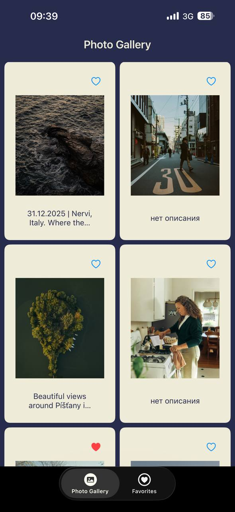
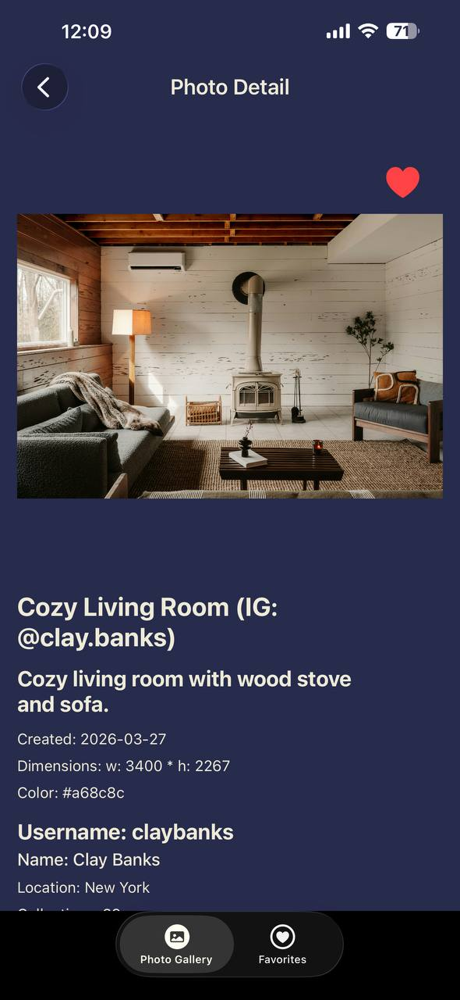
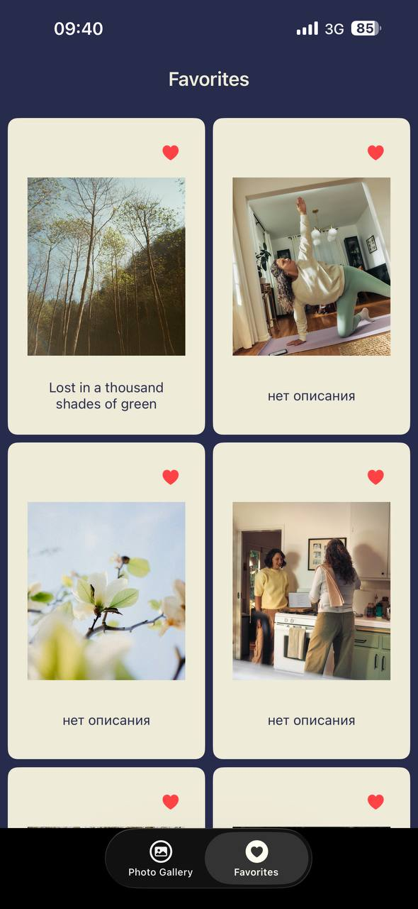

#  Gallery App


**GitHub:** [eviillia](https://github.com/eviillia)
**Tg:** [@oaoaoaoahh](https://t.me/oaoaoaoahh)

 The app allows users to browse a curated feed of photos from the Unsplash API, mark images as favourites, and view liked photos. The project demonstrates practices including MVVM architecture, Combine, Core Data, asynchronous networking and UIKit.
 


## Features

- **Gallery Screen:** 2-column grid layout with pagination. Photos load  of 30 as the user scrolls. Each cell displays a heart icon and title.
- **Detail Screen:** Large image view with full information – create at date, dimensions, color, author information (username, full name, location, collections count, Instagram). Users can like or unlike photos by tapping the heart button. Swipe left gesture navigates to the next photo.
- **Favourites Screen:** All liked photos in a grid. Photos can be removed from favourites by tapping the heart on cell. Favorite photos are saved locally using Core Data.
- **Visual :**  Added custom colours midnight  and vanilla. The application has an intuitive interface- **Pagination:** The app loads 30 photos per page as specified.
- **Favourite Indicator:** Favourite Indicator: Heart  update instantly when users like or unlike photos from the detail screen.
- **Swipe Navigation:**  On the detail screen, users can swipe left to view the next photo in the current list.
- **Empty State:** The favourites screen shows a message when no photos have been liked.
- **Date Formatting:** Unsplash creation dates are preserved and displayed in a readable format.
- **Fallback for Descriptions:** If a photo lacks a description, the alt_description(title) is shown instead; if both are missing, a default message appears.

## Architecture and Technologies

The project follows the MVVM  with Combine for reactive data binding. This ensures clear separation of tasks and makes code testable and maintainable.

**Core Components:**

- **Models:** Unsplash API: (`ReceivedPhotoApi`, `UrlsApi`, `UserApi`) and Core Data: (`FavoritePhoto`, `User`) for local persistence.
- **ViewModels:** `GalleryViewModel`, `PhotoDetailsViewModel`, `FavoritePhotosViewModel` - contain logic, manage state, and expose `@Published` properties.
- **Views:** UIKit: (`GalleryViewController`, `DetailPhotoViewController`, `FavoritePhotosViewController`) and custom cell (`PhotoCellView`).
- **Services:** `UnsplashService` handles network requests using `URLSession` and `async/await`; `PhotoStorage` with all Core Data operations: save, delete, fetch, check favourite status.

**Key Technologies:**

- Swift 
- UIKit 
- Combine 
- Core Data 
- URLSession with async/await 
- SwiftLint 
- Swift Testing 


## Screenshots

**gallery screenshot:**
<br>


**photo detail screenshot:**
<br>


**favorite photos screenshot:**
<br>



## Configuration and Setup

### Requirements

- Xcode 15+
- iOS 17.0+
- Swift 5.9

### Installation

1. Clone the repository:
   ```bash
   git clone https://github.com/eviillia/gallery_app.git
   cd gallery_app/gallery_app

2. Open the project:
   ```bash
   open gallery_app.xcodeproj

   
## Unsplash API Key

The application requires an access key to the Unsplash API to receive photos. 

To run the app:

Uncomment the `let accessKey` line in UnsplashService and paste your key.


## Running Tests

Unit tests are included for PhotoStorage. To run all tests:

In Xcode: 
```bash
Cmd + U

